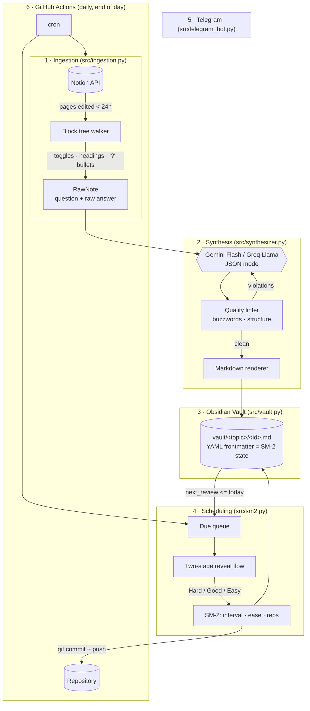
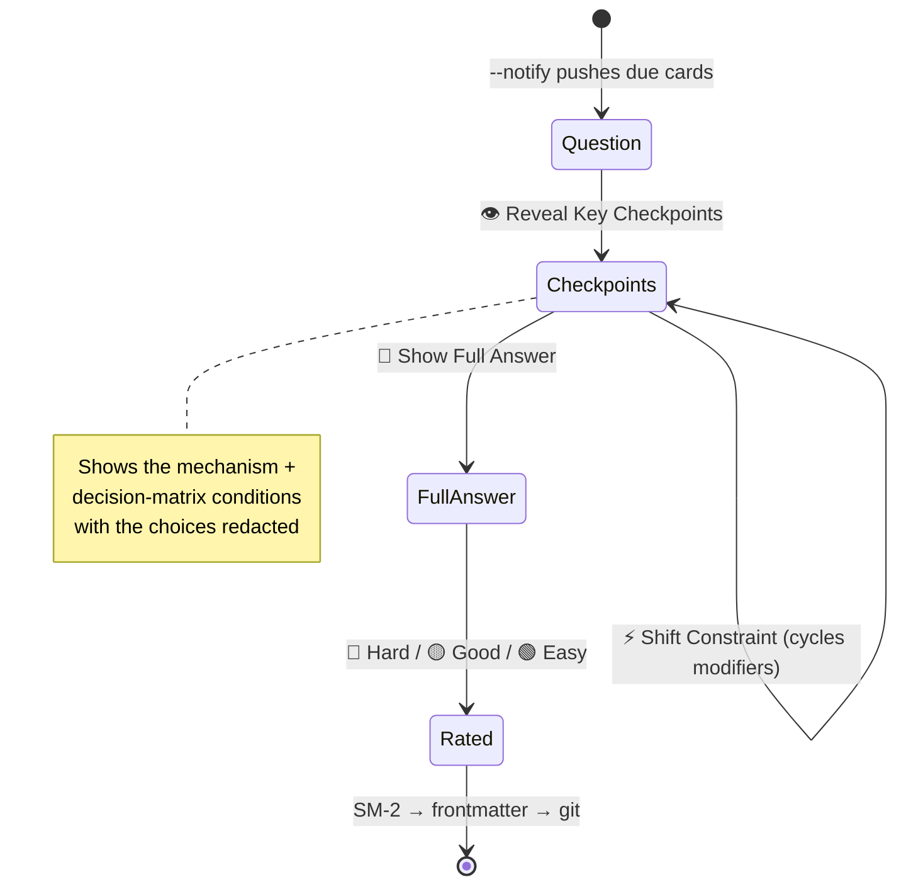

# 🧠 DeepRecall

Turn messy technical notes in Notion into **decision-tree flashcards**, store them
as plain Markdown in an Obsidian vault, and drill them over Telegram on an SM-2
spaced-repetition schedule — running entirely on free tiers.

The premise: re-reading notes builds *recognition*, not *recall*. And most
LLM-generated study material makes this worse, because "Kafka is fast and
scalable" is a sentence you can nod along to without understanding anything.
DeepRecall's synthesis prompt bans that class of sentence outright and forces
every card into a shape that has to be earned:

| Section                  | What it forces out of you                                       |
| ------------------------ | --------------------------------------------------------------- |
| **Direct Mechanism**     | The 30-second answer in syscalls, data structures and parameters |
| **Decision Matrix**      | `IF <constraint> THEN <choice> BECAUSE <trade-off>`              |
| **Tipping Point**        | When is this technology the **wrong** answer, and what wins?     |
| **Constraint Modifiers** | 2–3 changes that invalidate the architecture you just described  |

---

## Architecture



### The lifecycle of one card

```
 Notion toggle                LLM JSON                 vault/*.md
 ─────────────                ────────                 ──────────
 ▸ How does Kafka avoid   →   {                    →   ---
   copying bytes?               "direct_mechanism"     id: "kafka-zero-copy"
     - sendfile, page           "decision_matrix"      next_review: "2026-07-30"
       cache                    "tipping_point"        interval: 1
     - TLS breaks it            "constraint_mods"      ease_factor: 2.5
                              }                        ---
                                                       # Q: …
                                    ┌──────────────────────┘
                                    ▼
   Telegram  ──►  [👁️ Reveal]  ──►  [⚡ Shift]  ──►  [📖 Full]  ──►  [🔴🟡🟢]
                                                                       │
                        SM-2 recomputes interval / ease / next_review  │
                        rewrites the frontmatter, git commit + push  ◄──┘
```

### The Telegram state machine

Each stage re-renders **from the card file on disk**, and the card id travels in
`callback_data`. Nothing is held in memory between presses — so a card pushed by
a GitHub Actions run that has long since exited is still fully interactive when
a later `--bot-poll` session picks up the button press.



---

## Repository layout

```
deep-recall/
├── src/
│   ├── config.py          Env-backed config + per-command credential validation
│   ├── ingestion.py       Notion API → RawNote (toggles, headings, '?' bullets)
│   ├── synthesizer.py     Prompt, Gemini/Groq providers, quality linter, renderer
│   ├── vault.py           Card model, YAML frontmatter round-trip, due queries
│   ├── sm2.py             Pure SM-2 — no I/O, no globals
│   ├── telegram_bot.py    Inline-keyboard state machine, push + poll entry points
│   ├── git_sync.py        Commit/push a rated card
│   └── main.py            CLI
├── examples/
│   └── kafka-retry-patterns.md    ← what a generated card looks like
├── vault/                 your flashcards — git-ignored, see "Where your notes live"
├── tests/                 97 tests, no network required
├── .github/workflows/daily_sync.yml
├── .env.example
└── requirements.txt
```

---

## Where your notes live

Flashcards are your actual technical notes, so the vault is decoupled from the
code. Two supported layouts:

### Split (default) — public code, private notes

```
github.com/you/deep-recall          PUBLIC    code + workflow, unlimited CI minutes
github.com/you/deep-recall-vault    PRIVATE   vault/**.md only
```

The workflow checks the private vault out into `vault/` and commits ratings
there. **Actions minutes are billed to the repo that runs the workflow**, so a
public code repo gets unlimited free minutes even though every card it writes
stays private. `/vault/` is git-ignored here precisely so notes can never be
committed to the public repo by accident.

Enable it by setting the repository *variable* `VAULT_REPO` and the *secret*
`VAULT_TOKEN` (see step 5).

### Single repo — everything private

Simpler, but you burn the 2,000 min/month private-repo allowance and the code
isn't shareable. To use it: delete `/vault/` from `.gitignore`, leave
`VAULT_REPO` unset, and shorten `poll_minutes` to ~30 so the monthly budget
fits.

Both layouts run the same code — `git_sync` targets the vault directory and
lets git resolve the enclosing repository, so it commits to whichever repo
`vault/` actually belongs to.

---

## Setup

### 1. Install

```bash
git clone <your-fork> && cd deep-recall
python3 -m venv .venv && source .venv/bin/activate
pip install -r requirements.txt
cp .env.example .env          # then fill it in
```

### 2. Notion

1. Create an internal integration at <https://www.notion.so/my-integrations> and
   copy the token (`ntn_…`) into `NOTION_TOKEN`.
2. Open the page or database holding your notes → **⋯ → Connections → Connect
   to →** your integration. *Without this step the API returns zero pages and
   no error* — the most common setup failure.
3. Optionally set `NOTION_DATABASE_ID` to scope ingestion to one database.
   Left empty, DeepRecall searches every page the integration can see and
   filters to those edited in the last `INGEST_LOOKBACK_HOURS`.

**Note structure.** Three shapes are recognised as questions — write whichever
is natural:

```
▸ How does Kafka avoid copying bytes into user space?   ← toggle
    - sendfile(2), page cache straight to socket
    - TLS defeats it, back to user-space copies

## When would you not use Kafka?                        ← heading
- per-message routing, granular retries → RabbitMQ

- Why is the retry topic non-blocking?                  ← bullet ending in '?'
    - offset commits immediately, ordering is sacrificed
```

Everything nested underneath (to any depth) becomes the raw answer. Notes under
40 characters are skipped so empty toggles don't burn LLM quota.

### 3. LLM provider

| Provider   | Free tier                            | Get a key                            |
| ---------- | ------------------------------------ | ------------------------------------ |
| **Gemini** | **varies hugely by model** (see below) | <https://aistudio.google.com/apikey> |
| **Groq**   | ~30 req/min, ~1000 req/day           | <https://console.groq.com/keys>      |

> ⚠️ **Check the daily cap for your specific Gemini model before a big sync.**
> The free-tier request-per-day limit is per model and differs by orders of
> magnitude — some newer Flash models allow only **20 requests/day**, while
> older ones allow four figures. A 60-note backfill will die almost immediately
> on a 20/day model. Current limits:
> <https://ai.google.dev/gemini-api/docs/rate-limits>
>
> DeepRecall detects a *daily* quota error and stops the batch immediately
> rather than issuing one doomed request per remaining note; unsynced notes are
> simply picked up by the next run. Per-minute limits are still retried, using
> the provider's own `retryDelay` hint.

Set `LLM_PROVIDER=gemini` (default) or `groq`. Requests are throttled to one
every 4 seconds to stay inside the free rate limits. `GEMINI_MODEL` defaults to
`gemini-2.0-flash`; any Flash-class model works (`gemini-1.5-flash`,
`gemini-2.5-flash`).

### 4. Telegram

1. Message [@BotFather](https://t.me/BotFather) → `/newbot` → copy the token
   into `TELEGRAM_BOT_TOKEN`.
2. **Open Telegram, find your new bot, and send it any message.** A bot cannot
   see you until you message it first.
3. Look up your chat id:

```bash
python -m src.main --chat-id
```

> **The one mistake everyone makes.** A bot token looks like
> `1234567890:AAH…`. The number before the `:` is the **bot's** id, *not*
> yours. Putting it in `TELEGRAM_CHAT_ID` makes the bot message itself and
> every send fails with `Forbidden: the bot can't send messages to the bot`.
> `--chat-id` detects this and tells you so.

### 5. GitHub Actions

On the **code** repo, under **Settings → Secrets and variables → Actions**:

| Secrets tab          | Required                                      |
| -------------------- | --------------------------------------------- |
| `NOTION_TOKEN`       | yes                                           |
| `NOTION_DATABASE_ID` | optional                                      |
| `GEMINI_API_KEY`     | if `LLM_PROVIDER=gemini`                      |
| `GROQ_API_KEY`       | if `LLM_PROVIDER=groq`                        |
| `TELEGRAM_BOT_TOKEN` | yes                                           |
| `TELEGRAM_CHAT_ID`   | yes                                           |
| `VAULT_TOKEN`        | split layout — fine-grained PAT on the vault repo |

| Variables tab        | Required                                      |
| -------------------- | --------------------------------------------- |
| `VAULT_REPO`         | split layout — e.g. `you/deep-recall-vault`   |
| `LLM_PROVIDER`       | optional, defaults to `gemini`                |

`VAULT_REPO` goes in the **Variables** tab, not Secrets — the checkout action
needs it in plain text, and a repo name isn't a secret. Leave it unset to keep
the vault in this repo.

Secrets are safe in a public repo: workflows triggered from forked pull
requests never receive them, and `workflow_dispatch` requires write access. The
one rule is to read any PR that touches `.github/workflows/` before merging it.

The workflow runs once daily at **13:00 UTC = 21:00 Asia/Singapore**: sync →
notify → serve buttons for 4 hours → push. Trigger it by hand from the Actions
tab to test.

**When can you answer?** Cards land ~2 minutes after the run starts, and the
buttons stay live for `poll_minutes` (default 240), so roughly **21:03 → 01:03
SGT**. Miss it and nothing is lost — unrated cards stay due and are re-sent the
next day — but the buttons on the old message go dead, because a callback needs
a live poller to receive it. To rate outside the window, run `--bot-poll`
locally, or use the CLI:

```bash
python -m src.main --review <card-id> --quality good
```

`poll_minutes` can go up to ~330; GitHub caps a single job at 6 hours. Raise
`timeout-minutes` to match if you change it.

To move it, edit the one `cron` line in `daily_sync.yml` — **GitHub crons are
always UTC and never observe DST**, so subtract your offset yourself:

```yaml
- cron: "0 13 * * *"   # 21:00 SGT (UTC+8)  ← current
- cron: "0 14 * * *"   # 22:00 SGT
- cron: "0 11 * * *"   # 19:00 SGT
```

---

## Local execution

```bash
python -m src.main --sync                  # Notion → LLM → vault/*.md
python -m src.main --sync --dry-run        # show ingested notes, call no LLM
python -m src.main --sync --hours 168      # backfill the last week
python -m src.main --sync --limit 5        # cap LLM calls this run

python -m src.main --chat-id               # find your Telegram chat id
python -m src.main --notify                # push today's due cards
python -m src.main --bot-poll              # serve buttons until Ctrl-C
python -m src.main --bot-poll --duration 3000

python -m src.main --stats                 # vault overview + due list
python -m src.main --review kafka-retry-patterns --quality easy
```

Useful flags: `--force` (re-synthesise notes already in the vault), `--no-push`
(commit locally only), `--vault ./scratch` (work against a throwaway vault),
`-v` (debug logging).

Set `GIT_AUTO_COMMIT=false` in `.env` while experimenting locally.

In Telegram: `/review` pushes what's due now, `/due` lists it, `/stats` gives
the vault overview.

---

## Card schema

`vault/<topic-slug>/<card-id>.md`:

```markdown
---
id: "kafka-retry-patterns"
topic: "Distributed Systems"
created: "2026-07-29"
next_review: "2026-07-30"
interval: 1
ease_factor: 2.5
repetition_count: 0
source_note_id: "if-processing-of-one-message-failed-in-kafka"
source_url: "https://notion.so/…"
---

# Q: If processing of one message fails in Kafka, how do you retry without
     blocking partition consumption?

## Direct Mechanism
A consumer tracks one monotonic `offset` per partition, so retrying in place
stalls everything behind it…

## Decision Matrix
- **IF partition progress must not stall:** publish to `orders-retry-30s` and
  commit the main offset — *trade-off:* the record is now reordered.
- **IF strict per-key ordering is required:** `pause()` the TopicPartition and
  retry in place — *trade-off:* that partition's throughput drops to zero.

## Tipping Point (When is this WRONG?)
Wrong when retry policy must be per-message: delay is encoded by *which topic* a
record sits in, so every schedule costs another topic. Use RabbitMQ per-message
TTL + DLX, or Postgres with `SELECT … FOR UPDATE SKIP LOCKED`.

## Constraint Modifiers
- *Modifier 1 (Strict Ordering):* Retry topics become unusable…
- *Modifier 2 (Exactly-Once):* The produce and the offset commit must share a
  transaction via `sendOffsetsToTransaction()`…
```

Parsing is **structure-preserving**: frontmatter keys you add and `##` sections
you write yourself in Obsidian survive the bot rewriting the schedule. Writes
are atomic (`os.replace`), so an interrupted run can't truncate a card.

### How edits are handled

Four frontmatter keys make re-syncing idempotent *and* edit-aware:

| Key | Purpose |
| --- | ------- |
| `source_note_id` | Slug of the original Notion question. The LLM rewrites the question, so without this every run would regenerate the same note under a new slug |
| `source_block_id` | Notion block id — **stable when you reword a question**, so a retitled note updates its card instead of creating a duplicate |
| `source_hash` | Digest of the raw Notion answer. Differs on the next sync ⇒ the note was edited ⇒ regenerate |
| `body_hash` | Digest of the card body as generated. Differs ⇒ *you* edited the card in Obsidian |

The resulting decision table for each ingested note:

```
no matching card              -> synthesise a new one
hash matches                  -> skip, no LLM call
hash differs                  -> regenerate, keeping id, file path and SM-2 history
hash differs + hand-edited    -> skip, and warn (--force overrides)
card has no source_hash yet   -> backfill provenance, do not regenerate
```

Regeneration deliberately preserves `interval`, `ease_factor`,
`repetition_count` and `next_review`: editing a note should sharpen the card,
not reset months of review history. `body_hash` is written only by the
synthesizer and never by `save()`, so rating a card cannot be mistaken for a
hand edit.

---

## The SM-2 scheduler

`src/sm2.py` is the algorithm from Wozniak's 1987 paper, unmodified:

```
q < 3        → repetition_count = 0, interval = 1
q ≥ 3, rep 1 → interval = 1
q ≥ 3, rep 2 → interval = 6
q ≥ 3, rep n → interval = round(interval × ease_factor)

EF' = EF + (0.1 − (5−q) × (0.08 + (5−q) × 0.02)),  floored at 1.3
```

Buttons map to `Hard=1`, `Good=3`, `Easy=5`. One consequence worth knowing:
**"Good" nudges the ease factor down** (−0.14), because q=4 is the neutral point
in the original scale. That's deliberate, not a bug — a card you can only ever
*just* recall should slowly get denser.

Because of this the rating buttons are labelled with the **actual** interval
each choice would produce for that specific card (`🟡 Good (14d)`), computed via
`preview_intervals()`, rather than a hardcoded 1d/3d/7d.

---

## Cost

| Component      | Free tier                                            |
| -------------- | ---------------------------------------------------- |
| Notion API     | unlimited for internal integrations                  |
| Gemini / Groq  | model-dependent (20–1500/day) / ~1000 per day        |
| Telegram Bot   | unlimited                                            |
| GitHub Actions | unlimited on public repos, 2000 min/mo on private    |
| Storage        | Markdown in git                                      |

The default workflow uses ~55 min/day. With the **split layout** that costs
nothing — the workflow runs in the public code repo, where minutes are
unlimited, while the cards it writes stay in the private vault repo. Under the
single private-repo layout the same schedule would need ~1,590 of your 2,000
monthly minutes, so drop `poll_minutes` to ~30, or run `--bot-poll` on a
machine you already leave on.

---

## Troubleshooting

| Symptom | Cause |
| ------- | ----- |
| `--sync --dry-run` finds nothing | The Notion integration isn't connected to the page (Setup 2.2), or your notes aren't a toggle / heading / bullet ending in `?` |
| `Forbidden: the bot can't send messages to the bot` | `TELEGRAM_CHAT_ID` holds the **bot's** id — the digits before `:` in the token. Run `--chat-id` |
| `chat not found` | You never messaged the bot first |
| `--chat-id` says "No pending messages" | A `--bot-poll` session is running and consuming the update queue. Only one process can poll a bot at a time — stop it and retry |
| `Conflict: terminated by other getUpdates request` | Two pollers on one token. The bot now logs this once and exits rather than looping. Find the other one with `pgrep -fl "src.main --bot-poll"`, or check whether the CI run is live |
| `TimedOut` during `--bot-poll` startup | Slow link or VPN to `api.telegram.org`. Timeouts are 20s (`CONNECT_TIMEOUT` in `telegram_bot.py`); `--chat-id` is a good connectivity check because it bypasses the polling stack |
| `ModuleNotFoundError: dotenv` | Wrong interpreter — `pip install -r requirements.txt` into the venv you're actually running |
| Cards arrive but buttons do nothing | The poll window closed; callback queries go stale within minutes. Run `--bot-poll` locally when you want to review |
| CI: private vault checkout fails | `VAULT_TOKEN` expired, or lacks Contents: write on the vault repo |
| `429` / quota errors during sync | Free-tier rate limit — re-run with `--limit 5` |

---

## Testing

```bash
pip install -r requirements-dev.txt
python -m pytest tests/ -q          # 97 tests, ~1s, no network
```

Both network boundaries (Notion, the LLM) are faked, so the suite exercises the
real ingestion walker, prompt linter, Markdown round-trip, SM-2 arithmetic,
Telegram rendering and the full pipeline end to end.

---

## Design notes & limitations

- **Stateless callbacks.** All Telegram state lives in `callback_data` + the
  card file, so `--notify` and `--bot-poll` can run in different processes,
  hours apart. The cost is a 64-byte budget, which is why card ids are slugged
  to 48 characters.
- **The linter is a heuristic.** A banned word is only flagged when its own
  sentence contains no mechanism marker (a `backticked` identifier, a
  `syscall()`, big-O notation, or a number with units). It catches lazy
  generation; it can't verify that the mechanism described is *correct*. Cards
  are LLM output — read them critically, and edit them in Obsidian when they're
  wrong.
- **Partial failure is not total failure.** One unparseable note, one LLM
  timeout, or a failed `git push` never aborts the batch: the vault is the
  source of truth and is written before anything is pushed.
- **The bot has no per-user auth.** It answers whoever holds the bot token's
  chat. That's fine for a single-user vault; don't publish the token.
- **GitHub cron is approximate.** Scheduled runs queue under load, so 21:00 SGT
  means "shortly after", occasionally by 15–30 minutes. Cron is also UTC-only
  and DST-blind — irrelevant in Singapore, but a trap if you ever relocate.
